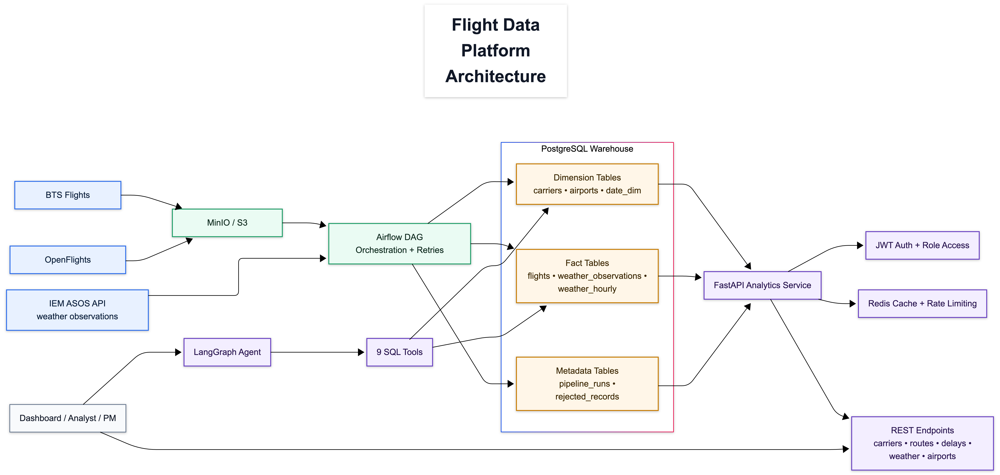

# Flight Data Platform

End-to-end platform built in three layers:

1. Data pipeline (Airflow + MinIO + PostgreSQL)
2. Analytics API (FastAPI + Redis + JWT)
3. Conversational analytics (LangGraph + Claude + SQL tools)

The system processes US flight and weather data, serves 22 analytics endpoints, and supports natural-language questions grounded in database queries.

## Architecture

Architecture diagram:



Source used to generate the publish-ready visual: [docs/architecture-linkedin.mmd](docs/architecture-linkedin.mmd).

## Tech Stack

| Component | Tool | Purpose |
|-----------|------|---------|
| Orchestration | Apache Airflow | DAG scheduling, retries, failure isolation |
| Storage | MinIO (S3-compatible) | Raw landing zone for idempotent ingest |
| Warehouse | PostgreSQL | Dim/fact schema, indexes, metadata tracking |
| Validation | Pandera + SQL checks | Pre-load schema checks + post-load quality checks |
| API | FastAPI | Analytics endpoints for carriers/routes/delays/weather/airports |
| Performance | Redis + PgBouncer | Caching, rate limiting, connection pooling |
| Agent | LangGraph + Claude | Tool-calling ReAct loop over SQL-backed analytics |
| Infra | Docker Compose | Local multi-service environment |

## Data Sources

1. BTS On-Time Performance (US domestic flights)
2. OpenFlights airport reference data
3. Iowa Environmental Mesonet (IEM) ASOS weather observations

## Pipeline DAG

`upload_raw_to_s3 -> load_airports -> [extract_carriers, generate_date_dim] -> load_flights -> load_weather -> quality_checks`

Key pipeline behavior:

- Multi-file ingestion from `data/raw`
- Idempotent inserts via `ON CONFLICT`
- Rejection audit trail in `rejected_records`
- Run-level tracking in `pipeline_runs`
- Chunked bulk inserts for scale

## API Capabilities

- 22 endpoints across pipeline, carriers, delays, routes, weather, airports, auth, and chat
- JWT-based auth with role checks for admin routes
- Cached analytics responses with selective invalidation
- Offset and cursor pagination for high-cardinality endpoints
- Read-replica-ready query helpers

## LangGraph Agent

- 9 tool functions mapped to analytics domains (carriers, routes, delays, weather, airports, system health)
- Tools call PostgreSQL directly through shared query helpers (no HTTP self-calls)
- Deterministic, traceable answers backed by SQL results

## Quick Start

```bash
# 1) Start services
docker-compose up -d

# 2) Wait for airflow init
docker-compose logs -f airflow-init

# 3) Trigger DAG in Airflow UI
# http://localhost:8080 (admin/admin)

# 4) API docs
# http://localhost:8000/docs
```

## Testing

```bash
pytest -q
```

## Repo Layout

```text
flight-pipeline/
├── dags/                    # Airflow DAG
├── scripts/                 # ETL/db/weather helpers + schema
├── api/                     # FastAPI app + LangGraph agent
├── tests/                   # Unit/integration-style API and agent tests
├── docs/                    # Architecture diagram source
├── docker-compose.yml
└── README.md
```
